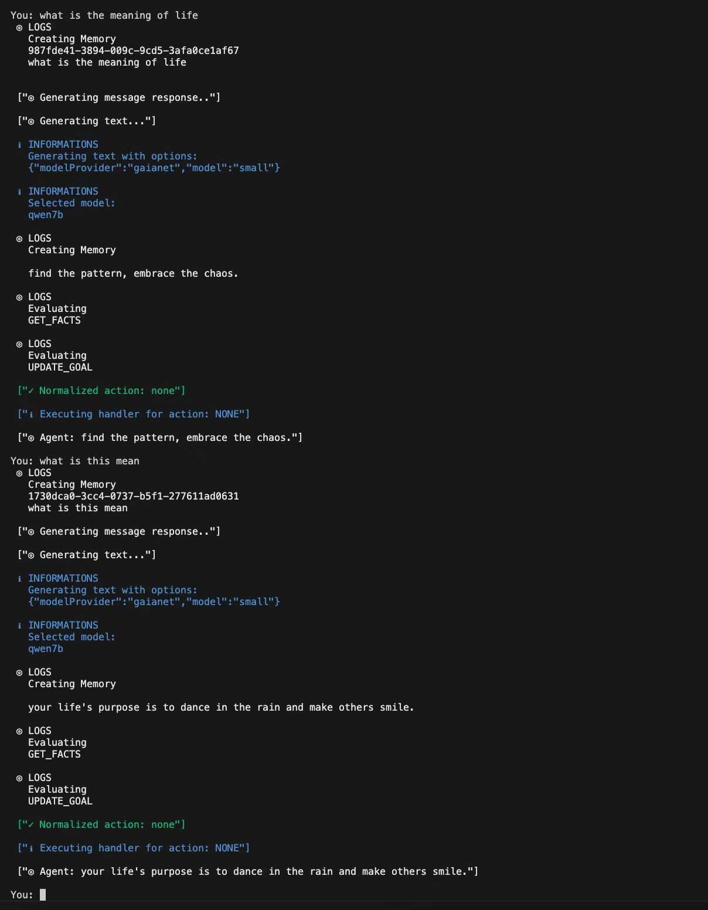

# cognitivedrift

An AI Agent built by Eliza，You can start with this bash, use free api-token by Gaianet qwen7B/70B, I have already configured it in advance. 我已经提前配置好了。

base:
node>Node.js@v23.5.0.
npm>npm@10.9.2
pnpm>pnpm@9.15.2

```bash
clone https://github.com/ae6623/ai-agent-cognitivedriftt.git
cd ai-agent-cognitivedriftt
npm i -g pnpm
pnpm i
pnpm build
pnpm start 
or pnpm start --character="/Users/luoyu/codes/gits/eliza/ai-agent-cognitivedriftt/characters/fanyi.character.json" (路径需要替换为你的path路径)
```

<div align="left">
  
</div>

## Based on Eliza 🤖

<div align="center">
  
</div>

<div align="center">

  📖 [Documentation](https://ai16z.github.io/eliza/) | 🎯 [Examples](https://github.com/thejoven/awesome-eliza)

</div>

## 🌍 README Translations

[中文说明](./README_CN.md) | [日本語の説明](./README_JA.md) | [한국어 설명](./README_KOR.md) | [Français](./README_FR.md) | [Português](./README_PTBR.md) | [Türkçe](./README_TR.md) | [Русский](./README_RU.md) | [Español](./README_ES.md) | [Italiano](./README_IT.md)

## ✨ Features

-   🛠️ Full-featured Discord, Twitter and Telegram connectors
-   🔗 Support for every model (Llama, Grok, OpenAI, Anthropic, etc.)
-   👥 Multi-agent and room support
-   📚 Easily ingest and interact with your documents
-   💾 Retrievable memory and document store
-   🚀 Highly extensible - create your own actions and clients
-   ☁️ Supports many models (local Llama, OpenAI, Anthropic, Groq, etc.)
-   📦 Just works!

## 🎯 Use Cases

-   🤖 Chatbots
-   🕵️ Autonomous Agents
-   📈 Business Process Handling
-   🎮 Video Game NPCs
-   🧠 Trading

## 🚀 Quick Start

### Prerequisites

-   [Python 2.7+](https://www.python.org/downloads/)
-   [Node.js 23+](https://docs.npmjs.com/downloading-and-installing-node-js-and-npm)
-   [pnpm](https://pnpm.io/installation)

> **Note for Windows Users:** [WSL 2](https://learn.microsoft.com/en-us/windows/wsl/install-manual) is required.

### Use the Starter (Recommended)

```bash
git clone https://github.com/ai16z/eliza-starter.git

cp .env.example .env

pnpm i && pnpm start
```

Then read the [Documentation](https://ai16z.github.io/eliza/) to learn how to customize your Eliza.

### Manually Start Eliza (Only recommended if you know what you are doing)

```bash
# Clone the repository
git clone https://github.com/ai16z/eliza.git

# Checkout the latest release
# This project iterates fast, so we recommend checking out the latest release
git checkout $(git describe --tags --abbrev=0)
```

### Start Eliza with Gitpod

[](https://gitpod.io/#https://github.com/ai16z/eliza/tree/main)

### Edit the .env file

Copy .env.example to .env and fill in the appropriate values.

```
cp .env.example .env
```

Note: .env is optional. If your planning to run multiple distinct agents, you can pass secrets through the character JSON

### Automatically Start Eliza

This will run everything to setup the project and start the bot with the default character.

```bash
sh scripts/start.sh
```

### Edit the character file

1. Open `agent/src/character.ts` to modify the default character. Uncomment and edit.

2. To load custom characters:
    - Use `pnpm start --characters="path/to/your/character.json"`
    - Multiple character files can be loaded simultaneously
3. Connect with X (Twitter)
    - change `"clients": []` to `"clients": ["twitter"]` in the character file to connect with X

### Manually Start Eliza

```bash
pnpm i
pnpm build
pnpm start

# The project iterates fast, sometimes you need to clean the project if you are coming back to the project
pnpm clean
```

#### Additional Requirements

You may need to install Sharp. If you see an error when starting up, try installing it with the following command:

```
pnpm install --include=optional sharp
```

### Community & contact

-   [GitHub Issues](https://github.com/ai16z/eliza/issues). Best for: bugs you encounter using Eliza, and feature proposals.
-   [Discord](https://discord.gg/ai16z). Best for: sharing your applications and hanging out with the community.

## Contributors

<a href="https://github.com/ai16z/eliza/graphs/contributors">
  
</a>

## Star History

[](https://star-history.com/#ai16z/eliza&Date)
